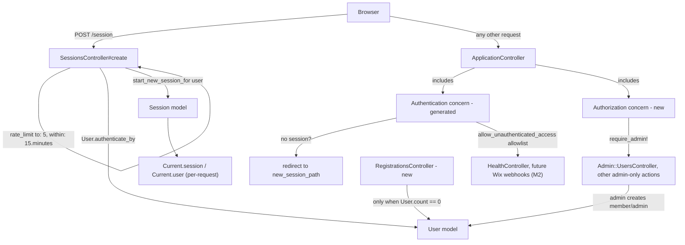

# In-App Authentication Design

**Spec**: `.specs/features/inapp-auth/spec.md`
**Context**: `.specs/features/inapp-auth/context.md`
**Status**: Draft

---

## Research Notes (Knowledge Verification Chain)

Followed the chain: codebase (n/a — no Rails code exists yet) → project docs (spec.md/context.md/ADR-002) → **Context7 MCP** (Rails 8 guides + API docs, queried directly) → not needed to reach web search.

**Key finding:** Rails 8 ships a built-in authentication generator (`bin/rails generate authentication`) that scaffolds almost exactly what AUTH-01 through AUTH-05 need out of the box:

- `app/models/user.rb` (`has_secure_password`, email normalization)
- `app/models/session.rb`, `app/models/current.rb` (`Current.user` / `Current.session` request-scoped attributes)
- `app/controllers/concerns/authentication.rb` — included in `ApplicationController`; **restricts every controller by default**, with `allow_unauthenticated_access only: %i[...]` as the per-controller opt-out (this is exactly our AUTH-04 "protected by default" requirement — no bespoke plumbing needed)
- `app/controllers/sessions_controller.rb` (login/logout via `authenticate_by`, `start_new_session_for`)
- `app/controllers/passwords_controller.rb` + `PasswordsMailer` (password reset — covers P3, deferred wiring of actual SMTP delivery)
- Migrations for `users` (`email_address:string!:uniq`, `password_digest:string!`) and `sessions` (`user:references`, `ip_address:string`, `user_agent:string`)
- Adds `bcrypt` to the Gemfile

Rails 8 also ships a built-in `rate_limit` controller macro (`ActionController::RateLimiting`), and the official guide's own example applies it to a `SessionsController#create` action — directly matching AUTH context.md's "rate-limit/lockout" decision, no external gem needed.

**Uncertain / flagged for later:** Exact Ruby/Rails patch version to pin is not decided here (tracked in STATE.md todo) — this design assumes "Rails 8.x with the authentication generator and `rate_limit` macro available," both present as of Rails 8.0+/8.1.3 per the docs queried on 2026-07-15.

---

## Architecture Overview

Everything not on an explicit public allowlist is denied by default via the generated `Authentication` concern. Role is a plain attribute on `User`; authorization is a thin concern layered on top of the generator's output, not a separate gem (no need for Pundit/CanCanCan at 2-role scale).



---

## Code Reuse Analysis

### Existing Components to Leverage (generated, not hand-written)

| Component | Location | How to Use |
|---|---|---|
| `bin/rails generate authentication` | Rails 8 built-in generator | Run once as the first implementation step; gives User/Session/Current models, Authentication concern, SessionsController, PasswordsController, migrations, bcrypt |
| `ActionController::RateLimiting#rate_limit` | Rails 8 built-in (`action_controller`) | Apply directly to `SessionsController#create`, no gem needed |
| `allow_unauthenticated_access` | Generated `Authentication` concern | Use on `HealthController` now (SCAF-05) and on the Wix webhook controller in M2 — this is the *only* allowlist mechanism, keeping AUTH-04 and ADR-004's "webhooks are the one public surface" enforceable in one place |

### Integration Points

| System | Integration Method |
|---|---|
| `rails-app-scaffold` feature (SQLite/Minitest setup) | This feature's migrations run against the scaffold's SQLite DB; `bin/rails test` (from SCAF-04) is the test runner for all tests below |
| Health check (SCAF-05) | `HealthController` must call `allow_unauthenticated_access` — cross-reference when scaffold's health route is implemented |
| Future Wix webhooks (M2) | Will use the same `allow_unauthenticated_access` mechanism, but with JWT verification instead of a session — not built here, just keeping the door open |
| Future audit log (M4) | `Current.user` is the natural actor reference for audit entries — no coupling needed now, just don't rename this later |

---

## Components

### User (extends generated model)

- **Purpose**: Identity + role. Exactly one of `admin`/`member`.
- **Location**: `app/models/user.rb`
- **Interfaces**:
  - `admin?: Boolean` — from `enum :role`
  - `member?: Boolean` — from `enum :role`
  - `User.authenticate_by(params): User | nil` — generated, unchanged
- **Dependencies**: `has_secure_password` (generated), `bcrypt` gem (generated)
- **Reuses**: Generated `User` model; adds `role` enum column + validation only

### Session, Current (generated, unchanged)

- **Purpose**: Per-device session record (`Session`) and per-request current-user/session accessor (`Current`)
- **Location**: `app/models/session.rb`, `app/models/current.rb`
- **Reuses**: Generated as-is — no changes needed for M0

### Authentication concern (generated, unchanged)

- **Purpose**: Deny-by-default route protection; `allow_unauthenticated_access` allowlist mechanism
- **Location**: `app/controllers/concerns/authentication.rb`
- **Reuses**: Generated as-is — this alone satisfies AUTH-04

### Authorization concern (new)

- **Purpose**: Admin-only gating for controllers/actions, reusable everywhere (satisfies AUTH-09's "not duplicated ad hoc" requirement)
- **Location**: `app/controllers/concerns/authorization.rb`
- **Interfaces**:
  - `require_admin!: void` — `before_action`, renders 403 (or redirects) if `Current.user` is not `admin?`
- **Dependencies**: `Current.user` from the generated `Current` model
- **Reuses**: Same `before_action` pattern as the generated `Authentication` concern, for consistency

### SessionsController (extends generated controller)

- **Purpose**: Login/logout
- **Location**: `app/controllers/sessions_controller.rb`
- **Interfaces**: `new`, `create` (generated), `destroy` (generated)
- **Dependencies**: `rate_limit to: 5, within: 15.minutes, only: :create` added on top of the generated controller
- **Reuses**: Generated controller body (`authenticate_by`, `start_new_session_for`) is kept as-is; only the rate limit line is added

### RegistrationsController (new)

- **Purpose**: First-admin bootstrap only — satisfies AUTH-10/11/12
- **Location**: `app/controllers/registrations_controller.rb`
- **Interfaces**:
  - `new: void` — renders signup form, but only reachable if `User.count.zero?`
  - `create: void` — creates the first user with `role: :admin`; any request when `User.count > 0` redirects to login (not 404, so it fails soft and obviously)
- **Dependencies**: `allow_unauthenticated_access` (no session exists yet, by definition)
- **Reuses**: `User` model's `has_secure_password` validations

### Admin::UsersController (new)

- **Purpose**: Admin-only member/admin account creation — satisfies AUTH-13/14 (P2)
- **Location**: `app/controllers/admin/users_controller.rb`
- **Interfaces**: `index`, `new`, `create`, `edit`, `update` — standard resourceful actions, admin sets email/password/role directly (no emailed invite in M0, since SMTP delivery isn't configured yet — see Deferred in context.md)
- **Dependencies**: `Authorization#require_admin!`
- **Reuses**: `User` model validations; Hotwire/Tailwind form patterns from `rails-app-scaffold`

### HealthController (cross-reference to `rails-app-scaffold`, not built here)

- Must call `allow_unauthenticated_access` — note for whoever implements SCAF-05 so it isn't accidentally locked behind login

---

## Data Models

### users

```ruby
create_table :users do |t|
  t.string :email_address, null: false
  t.string :password_digest, null: false
  t.integer :role, null: false, default: 0 # enum: { member: 0, admin: 1 }
  t.timestamps
end
add_index :users, :email_address, unique: true
```

**Relationships**: `has_many :sessions, dependent: :destroy` (generated)

### sessions (generated, unchanged)

```ruby
create_table :sessions do |t|
  t.references :user, null: false, foreign_key: true
  t.string :ip_address
  t.string :user_agent
  t.timestamps
end
```

**Relationships**: `belongs_to :user`

---

## Error Handling Strategy

| Error Scenario | Handling | User Impact |
|---|---|---|
| Invalid email/password on login | `authenticate_by` returns `nil`; generic message, same wording as any other login failure | "Try another email address or password." (no hint whether the email exists) |
| Rate limit exceeded on login | `rate_limit` raises `ActionController::TooManyRequests` → 429 by default; customize `with:` to redirect to login with a generic "too many attempts" alert | Same generic-failure feel, doesn't reveal account state |
| Registration attempted when `User.count > 0` | `RegistrationsController` redirects to `new_session_path` instead of creating a user or 404ing | Looks like "please log in," not an error page |
| Non-admin hits an admin-only action | `Authorization#require_admin!` renders 403 (no admin-only content leaked) | Plain "not authorized" page |
| Tampered/invalid session cookie | Generated `Authentication` concern treats it as no session — standard redirect-to-login flow | Same as a logged-out visitor, no crash |
| CSRF token missing/invalid | Rails' default `protect_from_forgery` (on by default in Rails apps) | Request rejected before reaching the action |

---

## Tech Decisions (only non-obvious ones)

| Decision | Choice | Rationale |
|---|---|---|
| Base scaffolding | Rails 8's `bin/rails generate authentication`, extended rather than hand-rolled | Matches ADR-001's "lean on framework conventions" driver directly; verified via Context7 that it already implements AUTH-01 through -05's shape |
| Role storage | `role:integer` ActiveRecord `enum`, default `member` | Cheapest possible 2-value model; avoids a separate `roles`/join table that ADR-002 explicitly says is overbuilt for now |
| Rate limit numbers | `to: 5, within: 15.minutes` on `SessionsController#create` | Fills the "agent's discretion" gap from context.md; tighter than the Rails guide's own example (`10 / 3.minutes`) since this app has no self-service signup to generate legitimate retry traffic |
| Session expiry | Not implemented as a custom fixed-expiry mechanism in M0; generated `Session` rows persist until explicit logout | **Open question carried forward, not fully resolved here** — see below |
| First-admin bootstrap gating | Model-level check (`User.count.zero?`) in the controller, not a Rails initializer/rake task | Keeps it inside normal request/response + Minitest integration testing, no separate ops step to remember |
| Password reset (P3) | Generated `PasswordsController` + `PasswordsMailer` kept, but actual mail delivery (SMTP config) is out of scope for M0 | Matches spec.md's P3 framing — mechanism exists, "TBD" on whether it's wired before cutover |

### Open question not fully resolved: fixed session expiry mechanism

context.md calls for "fixed expiry, default 14 days" but Rails' generated `Session` model has no built-in TTL — it's just a DB row until deleted. Implementing a true fixed-expiry requires either (a) a `expires_at` column + a check in the `Authentication` concern, or (b) an `ActionDispatch::Session` cookie `expire_after` (which expires the *cookie*, not the DB-backed session row, so stale `Session` rows would accumulate). This wasn't in the Context7 docs queried and needs a decision at Tasks/Execute time — flagging as uncertain rather than fabricating a mechanism. Recommend: add `expires_at` to the `sessions` migration above and check it in the `Authentication` concern's `resume_session` — cheap, testable, and keeps expiry DB-driven rather than cookie-driven.

---

## Note on Diagram Tooling

`mermaid-studio` skill is not installed in this environment, so the diagram above is inline Mermaid rather than rendered/validated output. Installing `mermaid-studio` would give richer diagram rendering (SVG/PNG, validation, theming) for future design docs.
